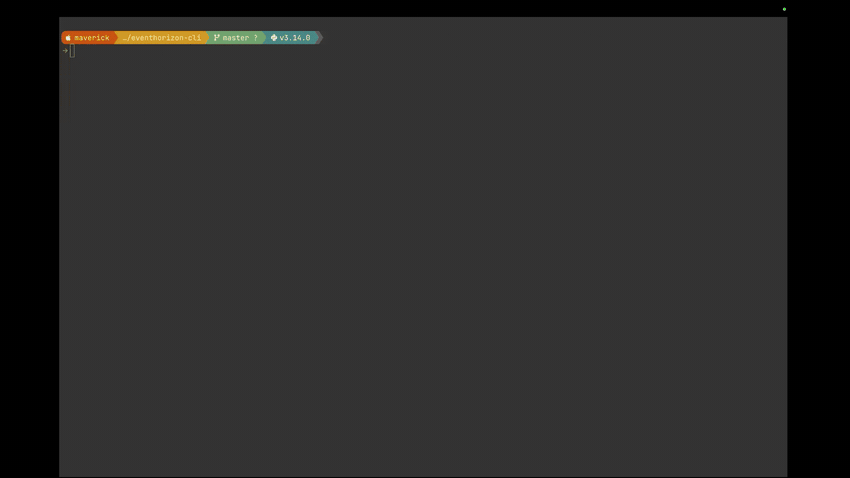

# EventHorizon CLI

[](https://opensource.org/licenses/MIT)
[](https://www.python.org/downloads/)
[](CONTRIBUTING.md)
[](https://github.com/qed42/eventhorizon-cli-mode/stargazers)

> **Audit your Drupal codebase for security, performance, and code quality — entirely on your own machine.** No source ever leaves your laptop. No AI, no cloud, no telemetry.

<p align="center">
  
</p>

A fast, focused command-line tool for **Drupal codebase static analysis**. It scans your custom and contrib modules for **performance anti-patterns**, **security vulnerabilities**, and **code quality metrics** — including Drupal config validation — then exports actionable reports as CSV and XLSX files from the terminal.

**Everything runs locally.** Every rule, metric, and report is computed on your machine — your code is never uploaded to a server, sent to an API, or fed to a model. That makes EventHorizon safe to run on client code, in air-gapped environments, and inside locked-down CI pipelines.

> 🛰️ **This is the open-source CLI edition.** A richer, team-oriented EventHorizon experience is on the horizon — [star the repo](https://github.com/qed42/eventhorizon-cli-mode) to follow along.

```
  ███████╗██╗   ██╗███████╗███╗   ██╗████████╗
  ██╔════╝██║   ██║██╔════╝████╗  ██║╚══██╔══╝
  █████╗  ██║   ██║█████╗  ██╔██╗ ██║   ██║
  ██╔══╝  ╚██╗ ██╔╝██╔══╝  ██║╚██╗██║   ██║
  ███████╗ ╚████╔╝ ███████╗██║ ╚████║   ██║
  ╚══════╝  ╚═══╝  ╚══════╝╚═╝  ╚═══╝   ╚═╝
  ██╗  ██╗ ██████╗ ██████╗ ██╗███████╗ ██████╗ ███╗   ██╗
  ██║  ██║██╔═══██╗██╔══██╗██║╚══███╔╝██╔═══██╗████╗  ██║
  ███████║██║   ██║██████╔╝██║  ███╔╝ ██║   ██║██╔██╗ ██║
  ██╔══██║██║   ██║██╔══██╗██║ ███╔╝  ██║   ██║██║╚██╗██║
  ██║  ██║╚██████╔╝██║  ██║██║███████╗╚██████╔╝██║ ╚████║
  ╚═╝  ╚═╝ ╚═════╝ ╚═╝  ╚═╝╚═╝╚══════╝ ╚═════╝ ╚═╝  ╚═══╝

  See beyond your codebase.
```

***

## What It Does

EventHorizon CLI provides three analysis tools that work together:

### Security Analysis (25 static rules + config validation)

Detects vulnerabilities in your Drupal PHP, Twig, routing files, and exported configuration:

* Insecure `unserialize()` usage (RCE risk)
* Routes with `_access: 'TRUE'` (bypassed access control)
* Dangerous execution functions (`shell_exec`, `passthru`, `system`)
* XSS via `#markup` with unsanitized variables
* SQL injection via `$_GET`/`$_POST` in queries
* Unsafe Twig filters (`|raw`, `|safe_join`) and inline `<script>` tags
* Direct database connections bypassing Entity API
* Session tempstore without authentication checks
* `eval()`, `preg_replace` with `/e`, CSRF token disabled
* TLS verification disabled, direct `$_SESSION` access
* Config validation: orphaned paragraphs, broken field references, circular paragraph dependencies
* And more

### Performance Analysis (20 static rules + 11 caching detectors + config validation)

Identifies performance bottlenecks, caching issues, and config quality problems:

**Static Rules:**

* Cache explicitly disabled (`max-age => 0`)
* Entity loads inside loops (N+1 queries)
* `loadMultiple()` without an ID list (loads all entities)
* Page cache kill switch usage
* Database queries in theme preprocess functions
* Drupal function calls inside Twig loops
* Debug code left in production (`dpm`, `kint`, `dd`, `var_dump`)
* Twig debugging output (`{{ dump() }}`) and inline styles
* Broad `user` cache context (vs `user.roles` / `user.permissions`)
* Kernel event subscribers on every request
* Zero `max-age` on API/REST responses
* Slow file operations in hooks
* Assets loaded in `<head>` blocking rendering
* Deprecated `drupal_add_js()` / `drupal_add_css()`

**Context-Aware Caching Detectors:**

* Render arrays missing `#cache` metadata
* User-specific content without cache contexts
* Overly broad `'user'` context (vs `'user.permissions'`)
* Early rendering breaking cacheability bubbling
* Uncached database queries in expensive contexts
* Missing cache tags on `#cache` arrays
* Missed `drupal_static()` opportunities
* Custom cache bin opportunities
* Missing URL/route cache contexts
* Missing entity-specific cache tags
* BigPipe candidates (highly dynamic blocks)

**Config Validation:**

* Unused field storages (no field instances)
* Overly complex entities (>30 fields)
* Missing field help text / descriptions
* Duplicate paragraph types (consolidation opportunities)

### Code Metrics Analysis

Measures function-level code quality across PHP files:

* **Cyclomatic Complexity (CCN)** — flags functions with complexity > 10
* **Maintainability Index (MI)** — flags functions with MI < 65
* **Anti-pattern density** — counts service locator calls (`\Drupal::`), deep array access, magic render keys, global variables, error suppression

### Report Output

* **CSV** and **XLSX** files with 8 standardized columns (including Recommendation)
* **Terminal summary** with colored severity breakdown
* Severity mapping: `critical`/`error` -> **High**, `warning` -> **Medium**, `info` -> **Low**

***

## Requirements

* **Python 3.9+** — the setup script will check this for you and show install instructions if missing
* A Drupal codebase (standard composer, restricted, or multisite layout — auto-detected)

> **Don't have Python 3?** Install it first:
>
> | Platform      | Command                                                   |
> | ------------- | --------------------------------------------------------- |
> | macOS         | `brew install python`                                     |
> | Ubuntu/Debian | `sudo apt install python3 python3-venv`                   |
> | Fedora/RHEL   | `sudo dnf install python3`                                |
> | Windows       | [python.org/downloads](https://www.python.org/downloads/) |

***

## Installation

```Shell
# 1. Get the code
git clone https://github.com/qed42/eventhorizon-cli-mode.git
cd eventhorizon-cli-mode

# 2. One-command setup — creates a venv, installs deps, and activates it
source ./setup.sh
```

`setup.sh` checks for Python 3.9+, creates a `.venv`, installs all dependencies, and activates the environment in your current shell. When it finishes, two **equivalent** commands are on your PATH — **`eh`** (short) and **`eventhorizon`** (long):

```Shell
eh --help
```

> **Opening a new terminal later?** The `eh` command lives inside the project's virtual environment, so re-activate it first:
> ```Shell
> source /path/to/eventhorizon-cli-mode/.venv/bin/activate
> ```
> Tip: add that line to your `~/.zshrc` / `~/.bashrc` to always have `eh` available, or `pipx install /path/to/eventhorizon-cli-mode` for a global, isolated install.

***

## Usage

`eh` is the main command. Just point it at a Drupal project — **`eh <path>` is shorthand for `eh analyze <path>`** and runs the full analysis. (`eventhorizon` is a longer-named alias for the exact same command, if you prefer it in scripts.)

```Shell
# Show the splash screen and help
eh

# Analyze a Drupal project (security + performance + code metrics on custom modules)
eh /path/to/drupal-project

# Standard composer project — point at the root, webroot is auto-detected
eh /path/to/composer-project

# Or point directly at the webroot — both work
eh /path/to/composer-project/web

# Security-only analysis
eh /path/to/drupal-project --type security

# Performance-only, contrib modules, CSV output only
eh /path/to/drupal-project --type performance --filter contrib --format csv

# Code metrics only (cyclomatic complexity, maintainability index)
eh /path/to/drupal-project --type code-metrics

# Multisite — scan a specific site
eh /path/to/multisite-project --site site1

# Analyze all modules, save reports to a specific directory
eh /path/to/drupal-project --filter all --output ./my-reports

# Verbose mode (debug logging to stderr)
eh /path/to/drupal-project -v

# Quiet mode (suppress terminal output, only generate reports)
eh /path/to/drupal-project -q

# The long-form alias and explicit subcommand are equivalent:
eventhorizon analyze /path/to/drupal-project
```

### Command Options

| Flag               | Values                                           | Default                                       | Description                                                  |
| ------------------ | ------------------------------------------------ | --------------------------------------------- | ------------------------------------------------------------ |
| `--type`           | `performance`, `security`, `code-metrics`, `all` | `all`                                         | Type of analysis to run                                      |
| `--filter`         | `custom`, `contrib`, `all`                       | `custom`                                      | Scope to custom, contrib, or all modules                     |
| `--format`         | `csv`, `xlsx`, `both`                            | `both`                                        | Output file format                                           |
| `--output`         | directory path                                   | `<project>/eventhorizon-reports/<timestamp>/` | Where to save report files                                   |
| `--site`           | site name                                        | *(none)*                                      | For multisite projects: scan a specific site (e.g. `site1`)  |
| `-v` / `--verbose` | flag                                             | off                                           | Enable verbose debug logging                                 |
| `-q` / `--quiet`   | flag                                             | off                                           | Suppress terminal output (exit code and exports only)        |

### Output Files

By default, reports are saved inside the scanned project under a timestamped directory. Each run creates a new subfolder so previous results are never overwritten:

```
my-drupal-project/
└── eventhorizon-reports/
    ├── 2026-03-18_14-30-45/
    │   ├── performance_report_my-project_custom.csv
    │   ├── performance_report_my-project_custom.xlsx
    │   ├── security_report_my-project_custom.csv
    │   ├── security_report_my-project_custom.xlsx
    │   ├── code_metrics_report_my-project_custom.csv
    │   └── code_metrics_report_my-project_custom.xlsx
    └── 2026-03-19_09-15-22/
        └── ...
```

Report files follow the naming convention: `{type}_report_{project_name}_{filter}.{ext}`

Use `--output /custom/path` to override the default location.

Each file contains these columns:

| Column         | Description                                                                                          |
| -------------- | ---------------------------------------------------------------------------------------------------- |
| Category       | `Security` or `Performance`                                                                          |
| Severity       | `High`, `Medium`, or `Low`                                                                           |
| File           | Relative path to the file (from Drupal root)                                                         |
| Line           | Line number where the issue was found                                                                |
| Rule           | Rule ID (e.g., `insecure_unserialize`, `cache_disabled`, `high_cyclomatic_complexity`)               |
| Message        | Human-readable description of the issue                                                              |
| Tool           | Scanner that found it (`static_analyzer`, `caching_analyzer`, `code_metrics`, or `config_validator`) |
| Recommendation | Actionable fix suggestion (populated by config validator findings)                                   |

### Exit Codes

| Code | Meaning                                                                 |
| ---- | ----------------------------------------------------------------------- |
| `0`  | Analysis complete (prints a warning if high-severity issues were found) |
| `2`  | Invalid input (path doesn't exist or isn't a Drupal codebase)           |

***

## Supported Drupal Project Layouts

EventHorizon CLI **auto-detects** your project structure. Point it at the project root (or even directly at the webroot) and it figures out the layout, custom code locations, config directory, and multisite sites automatically.

### Standard (Composer-based with webroot)

The most common modern Drupal setup — composer project with `web/` or `docroot/`:

```
my-project/
├── composer.json
├── config/
│   └── sync/                      <-- Config detected here (outside webroot)
│       ├── node.type.article.yml
│       └── views.view.frontpage.yml
├── web/  (or docroot/)            <-- Webroot auto-detected
│   ├── core/
│   ├── modules/
│   │   ├── custom/                <-- Custom modules discovered via .info.yml
│   │   │   └── my_module/
│   │   │       └── my_module.info.yml
│   │   └── contrib/
│   └── themes/
│       └── custom/
│           └── my_theme/
│               └── my_theme.info.yml
└── vendor/                        <-- Automatically excluded from scanning
```

### Restricted (No webroot / legacy)

Older setups where the project root is the Drupal root:

```
my-drupal-site/
├── modules/
│   ├── custom/
│   └── contrib/
├── themes/
│   └── custom/
├── core/
├── sites/
└── config/
    └── sync/
```

### Multisite

Drupal multisite installations with per-site custom code:

```
my-multisite/
├── config/sync/
├── web/
│   ├── modules/custom/            <-- Shared custom modules
│   └── sites/
│       ├── default/
│       ├── site1/
│       │   ├── modules/           <-- Site-specific modules (auto-discovered)
│       │   └── themes/
│       └── site2/
│           └── modules/
```

### How Detection Works

- **Webroot**: Checks for `web/`, `docroot/`, or nested `{subdir}/web/` directories
- **Custom code**: Walks the filesystem for `*.info.yml` files, skipping `vendor/`, `core/`, `node_modules/`, `.git/`, and other non-project directories
- **Config**: Checks `config/sync`, `config/default`, other `config/{subdir}`, and `{webroot}/sites/default/config/`
- **Multisite**: Detects `sites/{name}/` directories containing custom modules/themes
- **Backward compatible**: Pointing directly at a webroot directory (e.g., `eh analyze /path/to/web`) still works

### What Gets Scanned

The CLI discovers custom code paths automatically via `.info.yml` files and scans these file types:

| Location | File Types |
|---|---|
| Custom modules & themes | `*.php`, `*.module`, `*.inc`, `*.theme`, `*.twig`, `*.routing.yml`, `*.libraries.yml` |
| Config directory (auto-detected) | `node.type.*.yml`, `field.storage.*.yml`, `field.field.*.yml`, `paragraphs.paragraphs_type.*.yml`, `views.view.*.yml` |

Directories automatically **excluded** from discovery: `vendor/`, `core/`, `node_modules/`, `.git/`, `.ddev/`, `tests/`, `test/`

### How It Works

```
eventhorizon analyze /path/to/project
        │
        v
┌───────────────────────┐
│ Detect Structure      │  Webroot? Multisite? Config location?
│ (6-phase detection)   │  Walks filesystem for .info.yml files
└───────┬───────────────┘
        │
        v
┌───────────────────────┐
│ Build Scan Targets    │  Maps discovered paths to scanner-ready targets
└───────┬───────────────┘
        │
        v
┌───────────────────────┐
│ Discover Modules      │  Scan for *.info.yml files under targets
└───────┬───────────────┘
        │
        v
┌──────────────────────────────────────────────────────────────┐
│                      Run Scanners                            │
│                                                              │
│  ┌──────────────────┐  ┌──────────────────┐                  │
│  │ Static Analyzer  │  │ Caching Analyzer │                  │
│  │ (45 YAML rules)  │  │ (11 detectors)   │                  │
│  │                  │  │                  │                  │
│  │ Security: 25     │  │ Context-aware    │                  │
│  │ Perf: 20         │  │ PHP analysis     │                  │
│  └────────┬─────────┘  └────────┬─────────┘                  │
│           │                     │                            │
│  ┌────────┴─────────┐  ┌───────┴──────────┐                  │
│  │ Code Metrics     │  │ Config Validator │                  │
│  │ CCN, MI,         │  │ (if config/sync  │                  │
│  │ anti-patterns    │  │  dir exists)     │                  │
│  └────────┬─────────┘  └───────┬──────────┘                  │
│           │                    │                             │
│           └────────┬───────────┘                             │
│                    v                                         │
│           Combined Findings                                  │
└────────────────────┬─────────────────────────────────────────┘
                     │
                     v
      ┌──────────────────────────────┐
      │ Filter by Category           │
      │ security / performance /     │
      │ code-metrics                 │
      └──────────┬───────────────────┘
                 │
       ┌─────────┼─────────┐
       v         v         v
┌───────────┐ ┌────────┐ ┌──────────────┐
│ CSV/XLSX  │ │Terminal│ │ Code Metrics │
│ Reports   │ │Summary │ │ Report       │
└───────────┘ └────────┘ └──────────────┘
```

***

## Project Structure (EventHorizon CLI source)

```
eventhorizon-cli-mode/
├── pyproject.toml                          # Package config (PEP 621)
├── README.md
├── ARCHITECTURE.md                         # Technical architecture
├── CHANGELOG.md                            # Release notes
├── CONTRIBUTING.md                         # How to contribute + add rules
├── CODE_OF_CONDUCT.md                      # Contributor Covenant
├── SECURITY.md                             # Vulnerability disclosure policy
├── LICENSE                                 # MIT
├── setup.sh                                # One-command venv bootstrap
├── src/
│   └── eventhorizon/
│       ├── __init__.py                     # Version (0.1.0)
│       ├── __main__.py                     # python -m eventhorizon
│       ├── cli.py                          # Click CLI entry point
│       ├── splash.py                       # ASCII banner
│       ├── scanner/
│       │   ├── static_analyzer.py          # YAML rule-based scanner
│       │   ├── caching_analyzer.py         # Context-aware caching scanner
│       │   ├── code_metrics.py             # LOC, CCN, MI, anti-pattern analysis
│       │   ├── config_analyzer.py          # Drupal config/sync parser
│       │   ├── config_validator.py         # Config quality validation
│       │   └── rules/
│       │       └── custom_rules.yml        # 45 analysis rules
│       ├── discovery/
│       │   └── module_finder.py            # .info.yml module discovery
│       ├── reporter/
│       │   ├── terminal_reporter.py        # Rich terminal summary
│       │   ├── csv_reporter.py             # CSV file export
│       │   └── xlsx_reporter.py            # XLSX file export
│       └── utils/
│           ├── severity.py                 # Severity mapping
│           └── drupal_detection.py         # Project structure detection
└── tests/
    ├── test_cli.py                         # CLI smoke tests
    ├── test_cli_integration.py             # Analyzer integration tests
    ├── test_drupal_detection.py            # Project structure detection tests
    ├── test_scanner.py                     # Static & caching scanner tests
    ├── test_custom_rules_new.py            # Additional rule tests
    ├── test_code_metrics.py                # Code metrics tests
    ├── test_config_analyzer.py             # Config parser tests
    ├── test_config_validator.py            # Config validation tests
    ├── test_reporter.py                    # Reporter unit tests
    └── fixtures/
        ├── sample_drupal/                  # Restricted layout fixture
        ├── sample_drupal_standard/         # Standard (composer + webroot) fixture
        └── sample_drupal_multisite/        # Multisite fixture
```

***

## Running Tests

```Shell
# Activate the virtual environment
source .venv/bin/activate

# Run all 105 tests
pytest tests/ -v

# Run with coverage
pytest tests/ -v --cov=eventhorizon
```

***

## Dependencies

| Package                                      | Version | Purpose                                   |
| -------------------------------------------- | ------- | ----------------------------------------- |
| [Click](https://click.palletsprojects.com/)  | >= 8.0  | CLI framework                             |
| [Rich](https://rich.readthedocs.io/)         | >= 13.0 | Colored terminal output, tables, progress |
| [PyYAML](https://pyyaml.org/)                | >= 6.0  | Rule file parsing                         |
| [openpyxl](https://openpyxl.readthedocs.io/) | >= 3.0  | XLSX report generation                    |

***

## Contributing

Contributions are welcome! See [CONTRIBUTING.md](CONTRIBUTING.md) for development setup, coding guidelines, and how to add new rules.

Please note that this project follows a [Code of Conduct](CODE_OF_CONDUCT.md).

## License

MIT — see [LICENSE](LICENSE) for details.
